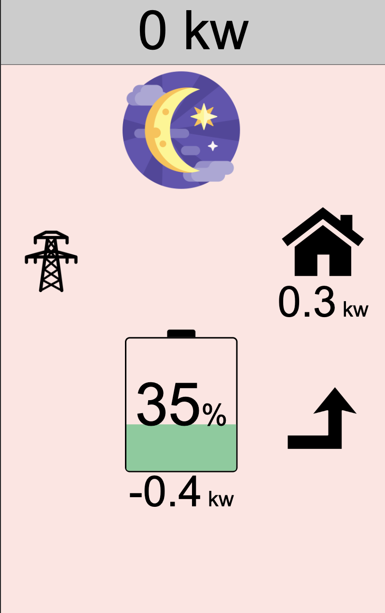
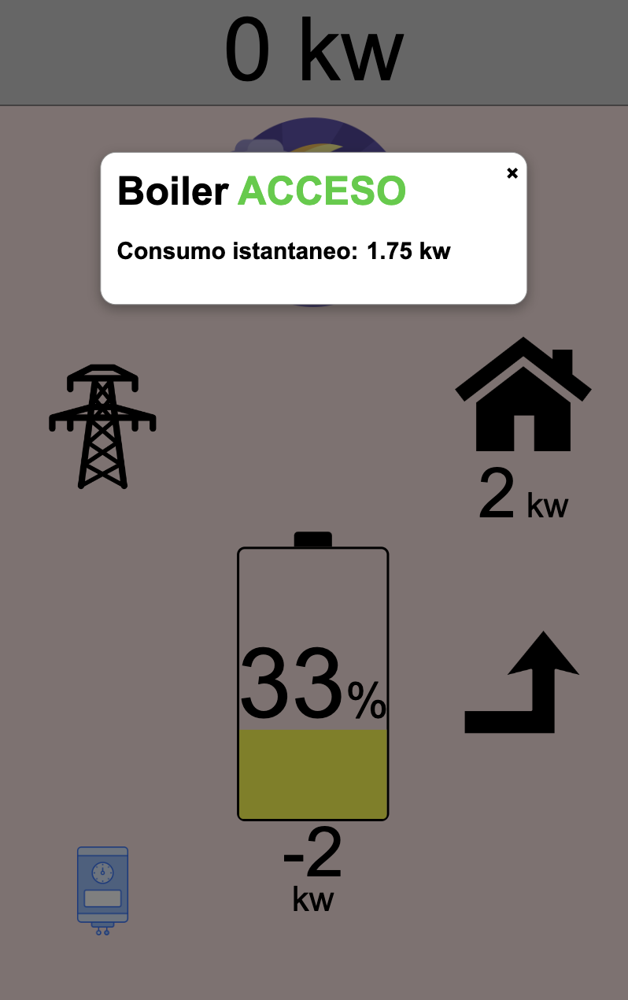
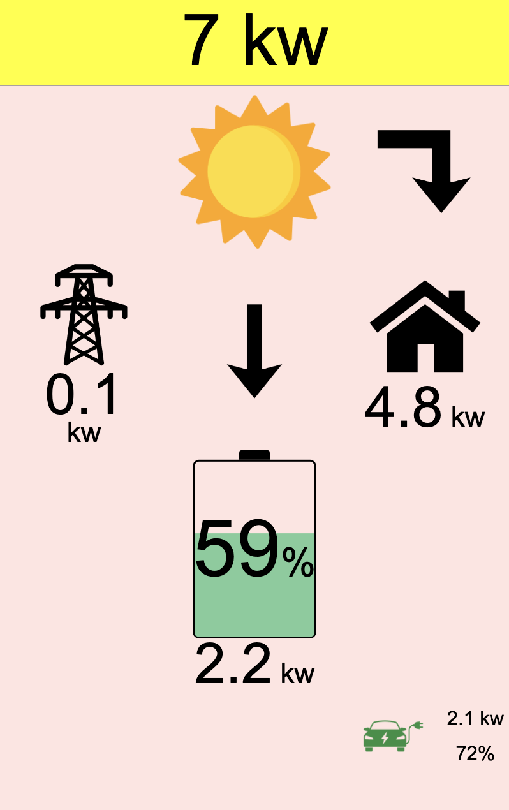

# Monitor4FV (MQTT or API)

## Introduction

The Node.js web server retrieves photovoltaic data from:
- MQTT (appMQTT.js)
- API (appAPI.js)

and displays it on a screen suitable for tablets or smartphones.  
The idea stems from a family need: at my parents' house, we have a photovoltaic system with storage, an electric water heater (to be used in the summer instead of the gas boiler), and an electric car. To avoid checking multiple smartphone applications, I developed this app to use on an old tablet to hang in the kitchen, allowing us to always have updated data at a glance (updates approximately every 3 seconds).  
Initially, I developed the API version, but then I realized that with **Home Assistant**, it is easier to use MQTT because I can send only the data that interests me and do so on a local network.  
The web server must run on a single machine (even the same one as the browser), and it is possible to use multiple clients that, through the browser, display the monitor with the photovoltaic data.


## Dependencies
You need to install `node` and `npm`.  
You need the following dependencies: `http express socket.io mqtt axios dotenv`

# Configuration 
Create a file `.env` in the project root.
## Configuration of API VERSION

If you decide to use `appAPI.js` then add the following fields to the `.env` file.```plaintext
# API
ENDPOINT=your_endpoint
TOKEN=your_token
```

## Configuration of MQTT VERSION
If you decide to use `appAPI.js` then add the following fields to the `.env` file.```plaintext
# MQTT
MQTT_USERNAME=mqtt_user
MQTT_PASSWORD=your_pwd
MQTT_CONNECT_TIMEOUT=3000
MQTT_HOST=your_ip
```

## Configuration of both versions (reciver.js)

It is necessary to modify the `reciver.js` file and set the JSON keys (whether using MQTT or API).
```javascript
pvGeneration = data['solaredge_potenza_totale_dc'];
gridSensor = data['prism_sensore_rete'];
homeConsumption = data['consumo_casa'];
batteryPVchargeDischarge = data['lg_carica_scarica_istantanea_kw'];
batteryPVpercentage = data['lg_percentuale_di_carica'];
boilerPower = data['shelly_consumo_boiler'];
// car
carBatteryPercentge = data['car_corsa_energy_level'];
carState = data['prism_stato'];
wallboxChargePower = data['prism_potenza_di_carica'];
wallboxPlugState = data['prism_plug_state'];
```
If you don't have some of these devices, do not delete the variable but set it to zero.

##  First Start

To start the web server, simply execute:

- `node appAPI.js`: to use the version that supports API
- `node appMQTT.js`: to use the version that supports MQTT

## Graphics
I chose to use clear, iconic drawings and a very large font size to meet my parents' needs.  
Remember that the purpose of this monitor is to be viewed on a wall-mounted tablet from a distance, not from a phone (although it is still possible to do so).



## Functions
- Monitoring of: photovoltaic and storage production, grid consumption, home consumption;
- Electric water heater consumption;
- Electric car consumption and battery percentage;
- Alert in case of high grid consumption;
- Alert in case of disconnection from the Node.js server or MQTT.

## Boiler
When the boiler is on (detected power consumption greater than zero), a small icon appears at the bottom left, helping to understand the high household consumption. You can click on the icon to view a window with the boiler's instantaneous consumption.  



## Electric Car
When the electric car is being charged and the charging power is greater than zero, an icon appears at the bottom right with the charging power and the car's battery percentage.  


